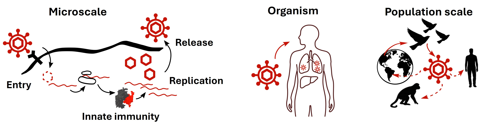

::: {.hero_home}

# virus evolution & host interaction lab

### We study virus evolution and their impact on virus-host dynamics at scale.

:::

## Research Vision

***Our research aims to increase our understanding of virus evolution to improve human health. 
Therefore, we combine computational and experimental approaches to study virus evolution and virus-host inetractions at scale: From microscopic virus-host protein interactions to  the population level.***

## Background

Viruses evolve constantly, often very fast. But how does this impact their dynamic interplay with the host? And at which level does this manifest? At the intracellular microscopic scale or at the population level? At the virus evolution & host interaction group, we investigate at scale how evolution shaped the currently observed virus host spectrum and how it impacts future interactions including cross-species transmission and therefore potential new pandemics.
Viruses are constrained by multiple factors on multiple scales why they are infecting the species they are currently infecting. At the microscopic level, the interaction of a virion with species-specific cell-surface proteins determines for example whether the virus can enter the cell at all or not. And on the population level, geographic distribution, contact frequencies and transmission modes impact whether a virus can establish itself in a given species or not.
Increasing our knowledge on the different constraints at different scales helps us to increase our pandemic preparedness by identifying animal viruses with low constraints to spread to the human population. And it helps us to get a better understanding how viruses shaped the evolution of their hosts in general.
 
 

{fig-alt="virus-host interactions at scale"}
***Virus-host interactions at scale: from microscopic intracellular interactions to the population scale.***
 
 

Our research investigates the evolution of viruses and how it impacts the interplay of viruses and their hosts. We focus on RNA viruses and novel RNA replicators with the aim to identify emerging viruses and what restricts cross-species transmission.

## Current Research Areas

- RNA virus discovery
- Characterization of novel, replicating circular RNAs
- Host-pathogen interactions
- Applying AI to identify constraints on the virus host spectrum

[Explore our research](../research/research.qmd){.btn .btn-primary}

## Latest News

- Pascal Mutz will start his independent group at the University of Ostrava within the LERCO project. Do you want to [JOIN US](../join/join.qmd){.btn .btn-primary} ?
- This webpage is under development. Expect major improvements soon!

