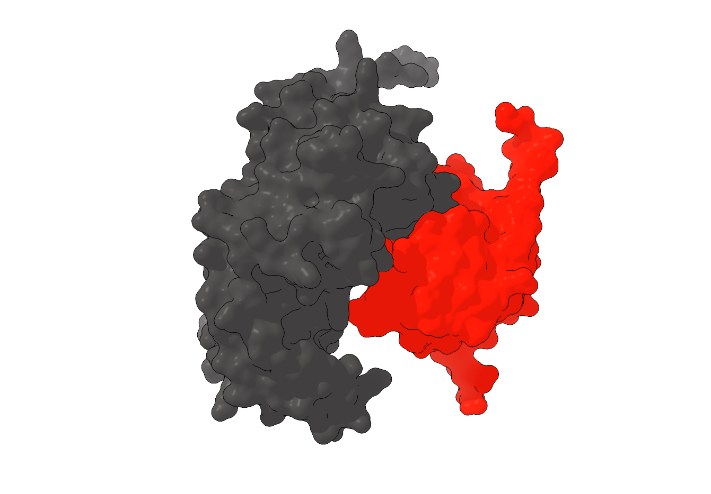
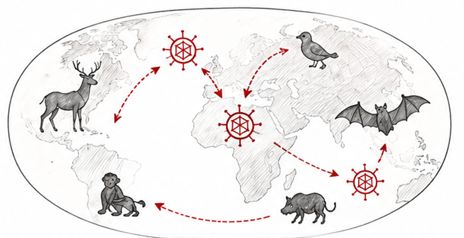

::: {.hero-subsection}

# Research

:::

# Main questions

***How many different viruses are out there? Which species can they infect? How many different ones?
And what are the constraints to infect some species but not others?
By perusing an interdisciplinary approach spanning bioinformatics and molecular biology approaches, 
we are looking for answers to these questions at scale.***

## Current Topics

::: {layout="[[65,35]]"}

### Virus discovery & characterization

Which viruses are out there and constitute the planet\’s \‘virosphere\’? 
Virus discovery has ramped up dramatically during the last years, especially 
due to decrease in sequencing costs and improved computational methods. 
And although hundreds of thousands of new viruses have been discovered 
recently, it seems that we are far from getting the full picture. We collaborate 
with other groups and conduct own bioinformatics-based projects 
to search publicly available datasets for yet 
undiscovered viruses with a focus on RNA viruses encoding for a RNA-directed 
RNA polymerase (RdRp) and, in a broader sense, mobile replicators 
whose genome is a covalently closed circular RNA. We set our findings in an 
evolutionary context using phylogenetics and phylodynamic analysis. 
By this, we contribute to a 
better understanding of our virosphere and path the way for future studies 
related to virus evolution & host interactions.

:::

::: {layout="[[35,65]]"}

{fig-alt="Profile photo" width="250"}

### Virus-host interactions at the microscale

How do virus-host interactions at the microscale constrain the host spectrum? 
This is largely unknown for diverse newly discovered viruses. We combine computational 
and molecular biology techniques to define the strength of the microscopic barriers 
constraining cross-species transmission of viruses such as binding to potential entry 
receptors and interactions with the innate immune system. This increases our understanding 
whether viruses are, from a molecular-biology perspective, capable of infecting a specific 
new host species and can thereby contribute to our pandemic preparedness.

:::

::: {layout="[[65,35]]"}

### Virus-host interactions at the microscale

How do life-history traits such as population size, contact frequency, geographic 
distribution and mobility constrain the virus host spectrum and shape thereby 
long-term virus-host (co-)evolution? And are there common trends across vertebrates 
and their diverse viral groups? Combining community-ecology based methods with the 
observed virus host spectrum and associated metadata, we shed light into a macroscopic, 
population scale barrier of the virus host spectrum. Modeling changing environments and 
their impact of life-history traits can help us to better predict the dynamics of these 
barriers and guide us to informed measures to reduce the risk of zoonotic events.

:::

